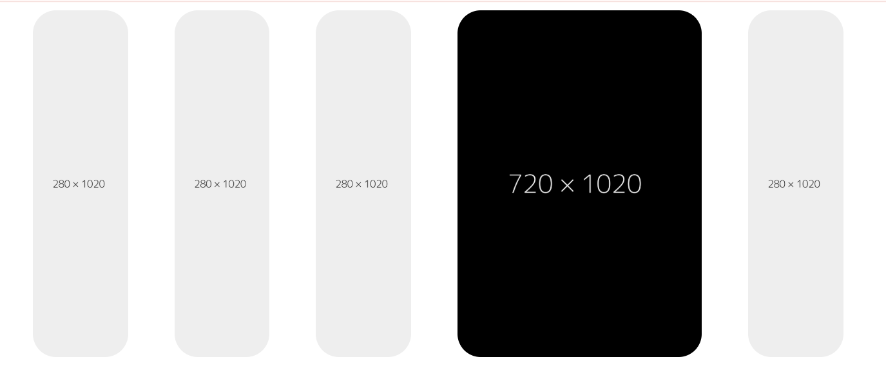

# 🎴 Expand Collapse Slider (HTML & CSS)

A modern **Expand / Collapse Card Slider UI Design** built using pure
**HTML & CSS**. When a user hovers over a card, it expands smoothly
while other cards collapse.

------------------------------------------------------------------------

## 🎨 Design Preview

You can: https://imgopi2002.github.io/expand-collapse-slider/
-   
  
------------------------------------------------------------------------

## 🚀 Features

-   Smooth expand & collapse animation
-   Built with pure HTML5 & CSS3
-   Flexbox layout
-   No JavaScript required
-   Lightweight and easy to customize
-   Responsive structure

------------------------------------------------------------------------

## 📁 Project Structure

    expand-collapse-slider/
    │
    ├── index.html
    ├── assets/
    │   ├── css/
    │   │   └── style.css
    │   └── img/
    │       ├── collapsed.png
    │       └── expand.png
    └── README.md

------------------------------------------------------------------------

## 📄 HTML Card Structure

``` html
<div class="expand-collapse-card">
    <a href="#">
        
        
    </a>
</div>
```

------------------------------------------------------------------------

## 🎯 How It Works

-   Cards are arranged using **CSS Flexbox**
-   Default state shows the collapsed image
-   On hover:
    -   The hovered card expands
    -   The expanded image appears
    -   Other cards shrink smoothly

All animations are handled using CSS transitions.

------------------------------------------------------------------------

## 🔧 Customization

You can:

-   Replace images with your own
-   Adjust animation speed in CSS
-   Modify card width and height
-   Add text overlays
-   Convert to click-based expand using JavaScript

Example transition:

``` css
.expand-collapse-card {
    transition: all 0.4s ease-in-out;
}
```

------------------------------------------------------------------------

## 📱 Use Cases

-   Portfolio showcase
-   Services section
-   Product highlights
-   Image gallery
-   Landing page hero section

------------------------------------------------------------------------

## 👨‍💻 Author

**Gopi C**\
Web Developer | WordPress | WooCommerce | Laravel | CodeIgniter | React | Tailwind CSS | JavaScript (ES6+)

Linkeding url : https://www.linkedin.com/in/gopi-c-14847a254?utm_source=share&utm_campaign=share_via&utm_content=profile&utm_medium=android_app

------------------------------------------------------------------------

⭐ If you like this project, don't forget to give it a star on GitHub!
